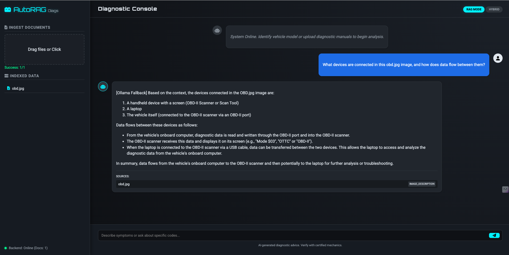

# AutoRAG Diagnostic Assistant

**AutoRAG Diagnostic Assistant** is an advanced AI-powered tool designed for automotive technicians and DIY enthusiasts. It bridges the gap between static technical documents and active diagnostics. By uploading service manuals (PDF), wiring diagrams, and real-time scanner screenshots (Images), users can interact with a "Hybrid" AI brain to troubleshoot complex vehicle faults.

It uniquely combines **Ollama (Local Vision AI)** for secure, private image analysis with **Google Gemini (Cloud AI)** for high-reasoning text generation, ensuring accurate diagnostic advice even when offline tools are needed.



*Above: The AutoRAG interface showing a "Hybrid" RAG response. The system analyzes an uploaded image of an OBD-II setup using local vision AI (Llama 3.2), extracts the diagnostic context, and provides a structured answer citing the source image.*

## Key Features
- **Multi-Format Support:** Reads PDF, DOCX, CSV, and Images.
- **AI Vision:** Automatically describes images (like wiring diagrams or scanner screens) so you can ask questions about them.
- **Hybrid Brain:** Uses **Google Gemini 2.0 Flash** for fast, high-quality answers, but automatically falls back to a local **Ollama (Llama 3)** model if the internet fails or quotas run out.
- **Automotive UI:** Professional dark-mode interface designed for technicians.

---

## How it Works (Under the Hood)
1.  **Ingestion:** When you upload a file, the system reads it. If it sees an image, it uses a local AI (`llama3.2-vision`) to "watch" the image and write a detailed description.
2.  **Indexing:** It saves all this text into a mathematical database (FAISS) that allows for super-fast searching.
3.  **Chat:** When you ask "What are the codes on the scanner?", the system searches its memory for relevant image descriptions or manual pages, then uses Google Gemini to write you a clear answer.

---

## Technical Architecture

The project is split into two parts:
1.  **Backend (`/backend`):** The Python brains. See `backend/README.md` for details on each file.
2.  **Frontend (`/frontend`):** The User Interface. See `frontend/README.md` for details.

---

## How to Run the App

### Prerequisites
1.  **Ollama**: You must have [Ollama](https://ollama.com/) installed and running.
    - Pull the text model: `ollama pull llama3`
    - Pull the vision model: `ollama pull llama3.2-vision`
2.  **Google API Key**: You need a free key from [Google AI Studio](https://aistudio.google.com/app/apikey).

### Steps
1.  **Start Ollama**:
    Open a terminal and run:
    ```bash
    ollama serve
    ```
2.  **Start the App**:
    Open a new terminal in this folder and run:
    ```bash
    ./run.sh
    ```
    *(The first time you run this, it will ask for your Google API Key in a `.env` file).*

3.  **Open Browser**:
    Go to: [http://localhost:8000](http://localhost:8000)

---

### Troubleshooting
- **"GenAI Failed"**: This usually means your free Google quota is used up. The system will automatically try to use your local Ollama model instead.
- **Scanner called "Smartphone"**: If the AI misidentifies tools, try re-uploading the image. We are using the advanced `llama3.2-vision` model to minimize this.
